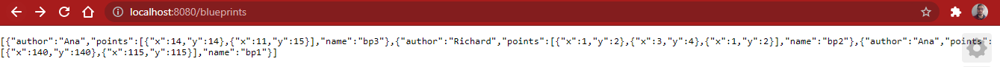
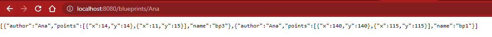
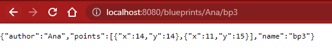
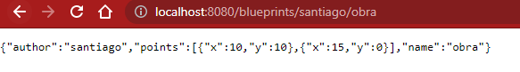

### Escuela Colombiana de Ingeniería

### Arquitecturas de Software


## Laboratorio API REST para la gestión de planos

### Dependencias
* [Laboratorio Componentes y conectores Middleware- gestión de planos (Blueprints) Parte 1](https://github.com/ARSW-ECI-beta/REST_API-JAVA-BLUEPRINTS_PART1)

### Descripción
En este ejercicio se va a construír el componente BlueprintsRESTAPI, el cual permita gestionar los planos arquitectónicos de una prestigiosa compañia de diseño. La idea de este API es ofrecer un medio estandarizado e 'independiente de la plataforma' para que las herramientas que se desarrollen a futuro para la compañía puedan gestionar los planos de forma centralizada.
El siguiente, es el diagrama de componentes que corresponde a las decisiones arquitectónicas planteadas al inicio del proyecto:


Donde se definió que:

* El componente BlueprintsRESTAPI debe resolver los servicios de su interfaz a través de un componente de servicios, el cual -a su vez- estará asociado con un componente que provea el esquema de persistencia. Es decir, se quiere un bajo acoplamiento entre el API, la implementación de los servicios, y el esquema de persistencia usado por los mismos.

Del anterior diagrama de componentes (de alto nivel), se desprendió el siguiente diseño detallado, cuando se decidió que el API estará implementado usando el esquema de inyección de dependencias de Spring (el cual requiere aplicar el principio de Inversión de Dependencias), la extensión SpringMVC para definir los servicios REST, y SpringBoot para la configurar la aplicación:


### Parte I

1. Integre al proyecto base suministrado los Beans desarrollados en el ejercicio anterior. Sólo copie las clases, NO los archivos de configuración. Rectifique que se tenga correctamente configurado el esquema de inyección de dependencias con las anotaciones @Service y @Autowired.

    Agregamos el paquete ```filters``` y en el la interfaz ```BlueprintsFilter```
    
    ```java
    public interface BlueprintsFilter {
        public Blueprint filter(Blueprint bp);
    }
    ```
    
    También agregamos la clase ```RedundancyFilter```  que extiende de la interfaz ```BlueprintsFilter```
    
    ```java
    @Service("RedundancyFilter")
    public class RedundancyFilter implements BlueprintsFilter {
        @Override
        public Blueprint filter(Blueprint bp) {
            ArrayList<Point> points=new ArrayList<Point>();
            for (Point i :bp.getPoints()){
                boolean found=false;
                for(Point j : points){
                    if(i.equals(j)){
                        found=true;
                        break;
                    }
                }
                if(!found)points.add(i);
            }
            return new Blueprint(bp.getAuthor(),bp.getName(),points);
        }

    }
    ```
    
    Y después la clase ```SubsamplingFilter``` que extiende de la interfaz ```BlueprintsFilter```
    
    ```java
    @Service("SubsamplingFilter")
    public class SubsamplingFilter implements BlueprintsFilter {
        @Override
        public Blueprint filter(Blueprint bp) {
            List<Point> oldPoints=bp.getPoints();
            ArrayList<Point> points=new ArrayList<Point>();
            for(int i=0;i<oldPoints.size();i++){
                if(i%2==0){
                    points.add(oldPoints.get(i));
                }
            }
            return new Blueprint(bp.getAuthor(),bp.getName(),points);
        }
    }
    ```
    
    Después agregamos el paquete ```filters``` y en el la clase ```Blueprint```
    
    ```java
    public class Blueprint {
        private String author=null;
        private List<Point> points=null;
        private String name=null;
        public Blueprint(String author,String name,List<Point> pnts){
            this.author=author;
            this.name=name;
            points=pnts;
        }
        public Blueprint(String author,String name,Point[] pnts){
            this.author=author;
            this.name=name;
            points=Arrays.asList(pnts);
        } 
        public Blueprint(String author, String name){
            this.name=name;
            this.author=author;
            points=new ArrayList<>();
        }
        public Blueprint() {}    
        public String getName() {
            return name;
        }
        public String getAuthor() {
            return author;
        }
        public List<Point> getPoints() {
            return points;
        }
        public void addPoint(Point p){
            this.points.add(p);
        }
        @Override
        public String toString() {
            return "Blueprint{" + "author=" + author + ", name=" + name + '}';
        }
        @Override
        public int hashCode() {
            int hash = 7;
            return hash;
        }
        @Override
        public boolean equals(Object obj) {
            if (this == obj) {
                return true;
            }
            if (obj == null) {
                return false;
            }
            if (getClass() != obj.getClass()) {
                return false;
            }
            final Blueprint other = (Blueprint) obj;
            if (!Objects.equals(this.author, other.author)) {
                return false;
            }
            if (!Objects.equals(this.name, other.name)) {
                return false;
            }
            if (this.points.size()!=other.points.size()){
                return false;
            }
            for (int i=0;i<this.points.size();i++){
                if (this.points.get(i)!=other.points.get(i)){
                    return false;
                }
            }
            return true;
        }
    }
    ```
    
    Y en el mismo paquete ```filters``` agregamos la clase ```Point```
    
    ```java
    public class Point {
        private int x;
        private int y;
        public Point(int x, int y) {
            this.x = x;
            this.y = y;
        }
        public Point() {}    
        public int getX() {
            return x;
        }
        public void setX(int x) {
            this.x = x;
        }
        public int getY() {
            return y;
        }
        public void setY(int y) {
            this.y = y;
        }
        @Override
        public String toString() {
            return "Point{" +
                    "x=" + x +
                    ", y=" + y +
                    '}';
        }
        @Override
        public boolean equals(Object obj) {
            boolean equals;
            if(!obj.getClass().getSimpleName().equals("Point")){
                equals = false;
            }
            else{
                Point point = (Point) obj;
                equals = point.getX()==x && point.getY()==y;
            }
            return equals;
        }
    }
    ```
    
    Ahora creamos el paquete ```persistence```  y en el la interfaz ```BlueprintsPersistence```
    
    ```java
    public interface BlueprintsPersistence {
        /**
         * 
         * @param bp the new blueprint
         * @throws BlueprintPersistenceException if a blueprint with the same name already exists,
         *    or any other low-level persistence error occurs.
        */
        public void saveBlueprint(Blueprint bp) throws BlueprintPersistenceException;
    
        /**
         * 
         * @param author blueprint's author
         * @param bprintname blueprint's author
         * @return the blueprint of the given name and author
         * @throws BlueprintNotFoundException if there is no such blueprint
        */
        public Blueprint getBlueprint(String author,String bprintname) throws BlueprintNotFoundException;
        public Set<Blueprint> getBlueprintsByAuthor(String author) throws BlueprintNotFoundException;
        public Set<Blueprint> getAllBlueprints();
    }
    ```
    
    En el mismo paquete creamos la clase ```BlueprintPersistenceException``` de tipo ```Exception```
    
    ```java
    public class BlueprintPersistenceException extends Exception{
        public BlueprintPersistenceException(String message) {
            super(message);
        }
        public BlueprintPersistenceException(String message, Throwable cause) {
            super(message, cause);
        }
    }
    ```
    
    Y otra clase ```BlueprintNotFoundException``` también de tipo ```Exception```
    
    ```java
    public class BlueprintNotFoundException extends Exception{
        public BlueprintNotFoundException(String message) {
            super(message);
        }
        public BlueprintNotFoundException(String message, Throwable cause) {
            super(message, cause);
        }
    }
    ```
    
    Después en el mismo paquete ```persistence``` creamos el paquete ```ìml``` y en el la clase ```Tuple```
    
    ```java
    public class Tuple<T1, T2> {
        T1 o1;
        T2 o2;
        public Tuple(T1 o1, T2 o2) {
            super();
            this.o1 = o1;
            this.o2 = o2;
        }
        public T1 getElem1() {
            return o1;
        }
        public T2 getElem2() {
            return o2;
        }
        @Override
        public int hashCode() {
            int hash = 7;
            hash = 17 * hash + Objects.hashCode(this.o1);
            hash = 17 * hash + Objects.hashCode(this.o2);
            return hash;
        }
        @Override
        public boolean equals(Object obj) {
            if (this == obj) {
                return true;
            }
            if (obj == null) {
                return false;
            }
            if (getClass() != obj.getClass()) {
                return false;
            }
            final Tuple<?, ?> other = (Tuple<?, ?>) obj;
            if (!Objects.equals(this.o1, other.o1)) {
                return false;
            }
            if (!Objects.equals(this.o2, other.o2)) {
                return false;
            }
            return true;
        }        
    }
    ```
    
    Y en el mismo paquete ```ìml``` creamos la clase ```InMemoryBlueprintPersistence``` que extiende de ```BlueprintsPersistence```
    
    ```java
    @Service("InMemoryBlueprintPersistence")
    public class InMemoryBlueprintPersistence implements BlueprintsPersistence{
        private final Map<Tuple<String,String>,Blueprint> blueprints=new HashMap<>();
        public InMemoryBlueprintPersistence() {
            Point[] pts1=new Point[]{new Point(140, 140),new Point(115, 115)};
            Blueprint bp1=new Blueprint("Ana", "bp1",pts1);
            blueprints.put(new Tuple<>(bp1.getAuthor(),bp1.getName()), bp1);	
        }    
        @Override
        public void saveBlueprint(Blueprint bp) throws BlueprintPersistenceException {
            Blueprint blueprint= blueprints.putIfAbsent(new Tuple<>(bp.getAuthor(),bp.getName()), bp);
            if (blueprint!=null){
                throw new BlueprintPersistenceException("The given blueprint already exists: "+bp);
            }
        }
        @Override
        public Blueprint getBlueprint(String author, String bprintname) throws BlueprintNotFoundException {
            Blueprint bp=blueprints.get(new Tuple<>(author, bprintname));
            if(bp==null)throw new BlueprintNotFoundException("El plano con estas caracteristicas no existe");
            return blueprints.get(new Tuple<>(author, bprintname));
        }
        @Override
        public Set<Blueprint> getBlueprintsByAuthor(String author) throws BlueprintNotFoundException {
            Set<Blueprint> ans = new HashSet<>();
            Set<Tuple<String,String>> llaves = blueprints.keySet();
            for(Tuple<String,String> i : llaves){
                if(i.getElem1().equalsIgnoreCase(author)){
                    ans.add(blueprints.get(i));
                }
            }
            if(ans.size()==0) throw new BlueprintNotFoundException("Este usuario no tiene planos");
            return ans;
        }
        @Override
        public Set<Blueprint> getAllBlueprints() {
            return new HashSet<Blueprint>(blueprints.values());
        }
    }
    ```
    
    Y finalmente creamos el paquete ```services```y en el la clase ```BlueprintsServices```
    
    ```java
    @Service("BlueprintsServices")
    public class BlueprintsServices {
        @Autowired
        @Qualifier("InMemoryBlueprintPersistence")
        BlueprintsPersistence bpp=null;

        @Autowired
        @Qualifier("RedundancyFilter")
        BlueprintsFilter bpf;
	
        public void addNewBlueprint(Blueprint bp) throws BlueprintPersistenceException {
            bpp.saveBlueprint(bp);
        }   
        public Set<Blueprint> getAllBlueprints(){
            return bpp.getAllBlueprints();
        }    
        /**
         * 
         * @param author blueprint's author
         * @param name blueprint's name
         * @return the blueprint of the given name created by the given author
         * @throws BlueprintNotFoundException if there is no such blueprint
        */
        public Blueprint getBlueprint(String author,String name) throws BlueprintNotFoundException{
            return bpp.getBlueprint(author,name);
        }
        /**
         * 
         * @param author blueprint's author
         * @return all the blueprints of the given author
         * @throws BlueprintNotFoundException if the given author doesn't exist
        */
        public Set<Blueprint> getBlueprintsByAuthor(String author) throws BlueprintNotFoundException{
            return bpp.getBlueprintsByAuthor(author);
        }
        public Blueprint filter(Blueprint bp){
            return bpf.filter(bp);
        }
    }
    ```

2. Modifique el bean de persistecia 'InMemoryBlueprintPersistence' para que por defecto se inicialice con al menos otros tres planos, y con dos asociados a un mismo autor.

    Actualizamos el constructor de la clase ```InMemoryBlueprintPersistence``` para cumplir las periciones que nos piden
    
    ```java
    public InMemoryBlueprintPersistence() {
        Point[] pts1=new Point[]{new Point(140, 140),new Point(115, 115)};
        Point[] pts2= new Point[] {new Point(1,2),new Point(3,4),new Point(1,2)};
        Point[] pts3=new Point[]{new Point(14, 14),new Point(11, 15)};
        Blueprint bp1=new Blueprint("Ana", "bp1",pts1);
        Blueprint bp2=new Blueprint("Richard","bp2",pts2);
        Blueprint bp3=new Blueprint("Ana","bp3",pts3);
        blueprints.put(new Tuple<>(bp1.getAuthor(),bp1.getName()), bp1);
        blueprints.put(new Tuple<>(bp2.getAuthor(),bp2.getName()), bp2);
        blueprints.put(new Tuple<>(bp3.getAuthor(),bp3.getName()), bp3);
    } 
    ```

3. Configure su aplicación para que ofrezca el recurso "/blueprints", de manera que cuando se le haga una petición GET, retorne -en formato jSON- el conjunto de todos los planos. Para esto:

    Para configurar ofrecer el recurso ```/bluesprints``` modificamos la clase ```BlueprintAPIController``` agregando el ```@RestController``` y el ```@RequestMapping()``` con ```value = "/blueprints"```
    
    ```java
    @RestController
    @RequestMapping(value = "/blueprints")
    public class BlueprintAPIController {
    }
    ```

    * Modifique la clase BlueprintAPIController teniendo en cuenta el siguiente ejemplo de controlador REST hecho con SpringMVC/SpringBoot:

    ```java
    @RestController
    @RequestMapping(value = "/url-raiz-recurso")
    public class XXController {        
        @RequestMapping(method = RequestMethod.GET)
        public ResponseEntity<?> manejadorGetRecursoXX(){
            try {
                //obtener datos que se enviarán a través del API
                return new ResponseEntity<>(data,HttpStatus.ACCEPTED);
            } catch (XXException ex) {
                Logger.getLogger(XXController.class.getName()).log(Level.SEVERE, null, ex);
                return new ResponseEntity<>("Error bla bla bla",HttpStatus.NOT_FOUND);
            }        
        }
    }
    ```

    Dentro de la clase ```BlueprintAPIController``` realizamos la implementación  del metodo ```manejadorBlueprints``` que representa la petición del codigo anterior
    
    ```java
    @RequestMapping(method = RequestMethod.GET)
    public ResponseEntity<?> manejadorBlueprints(){

        try {
            //obtener datos que se enviarán a través del API
            return new ResponseEntity<>(services.getAllBlueprints(), HttpStatus.ACCEPTED);
        } catch (Exception ex) {
            Logger.getLogger(BlueprintAPIController.class.getName()).log(Level.SEVERE, null, ex);
            return new ResponseEntity<>("Error",HttpStatus.NOT_FOUND);
        }
    }
    ```
	
    * Haga que en esta misma clase se inyecte el bean de tipo BlueprintServices (al cual, a su vez, se le inyectarán sus dependencias de persisntecia y de filtrado de puntos).
    
    Y para realizar la inyección del servicio ```BlueprintServices``` colocamos el ```@Autowired``` y el ```@Qualifier()``` dirigido hacia ```BlueprintsServices``` en el cuerpo de la clase ```BlueprintAPIController```
    
    ```java
    @Autowired
    @Qualifier("BlueprintsServices")
    BlueprintsServices services;
    ```

4. Verifique el funcionamiento de a aplicación lanzando la aplicación con maven:

    ```bash
    $ mvn compile
    $ mvn spring-boot:run
    ```
    
    Y luego enviando una petición GET a: http://localhost:8080/blueprints. Rectifique que, como respuesta, se obtenga un objeto jSON con una lista que contenga el detalle de los planos suministados por defecto, y que se haya aplicado el filtrado de puntos correspondiente.

    Resultado de la consulta
    
    

5. Modifique el controlador para que ahora, acepte peticiones GET al recurso /blueprints/{author}, el cual retorne usando una representación jSON todos los planos realizados por el autor cuyo nombre sea {author}. Si no existe dicho autor, se debe responder con el código de error HTTP 404. Para esto, revise en [la documentación de Spring](http://docs.spring.io/spring/docs/current/spring-framework-reference/html/mvc.html), sección 22.3.2, el uso de @PathVariable. De nuevo, verifique que al hacer una petición GET -por ejemplo- a recurso http://localhost:8080/blueprints/juan, se obtenga en formato jSON el conjunto de planos asociados al autor 'juan' (ajuste esto a los nombres de autor usados en el punto 2).

    Agregamos el siguiente metoo en la clase ```BlueprintAPIController``` para dar la petición
    
    ```java
    @RequestMapping(value="/{author}", method = RequestMethod.GET)
    public ResponseEntity<?>  manejadorBlueprintsByAuthor(@PathVariable("author") String author){

        try {
            //obtener datos que se enviarán a través del API
            return new ResponseEntity<>(services.getBlueprintsByAuthor(author), HttpStatus.ACCEPTED);
        } catch (Exception ex) {
            Logger.getLogger(BlueprintAPIController.class.getName()).log(Level.SEVERE, null, ex);
            return new ResponseEntity<>(HttpStatus.NOT_FOUND);
        }
    }
    ```
    
    Resultado de la consulta
    
    
    
    

6. Modifique el controlador para que ahora, acepte peticiones GET al recurso /blueprints/{author}/{bpname}, el cual retorne usando una representación jSON sólo UN plano, en este caso el realizado por {author} y cuyo nombre sea {bpname}. De nuevo, si no existe dicho autor, se debe responder con el código de error HTTP 404. 


    Agregamos el siguiente metoo en la clase ```BlueprintAPIController``` para dar la petición
    
    ```java
    @RequestMapping(value="/{author}/{name}", method = RequestMethod.GET)
    public ResponseEntity<?>  manejadorBlueprint(@PathVariable("author") String author,@PathVariable("name") String name ){
        try {
            //obtener datos que se enviarán a través del API
            return new ResponseEntity<>(services.getBlueprint(author,name), HttpStatus.ACCEPTED);
        } catch (Exception ex) {
            Logger.getLogger(BlueprintAPIController.class.getName()).log(Level.SEVERE, null, ex);
            return new ResponseEntity<>(HttpStatus.NOT_FOUND);
        }
    }
    ```
    
    Resultado de la consulta
    
    


### Parte II

1.  Agregue el manejo de peticiones POST (creación de nuevos planos), de manera que un cliente http pueda registrar una nueva orden haciendo una petición POST al recurso ‘planos’, y enviando como contenido de la petición todo el detalle de dicho recurso a través de un documento jSON. Para esto, tenga en cuenta el siguiente ejemplo, que considera -por consistencia con el protocolo HTTP- el manejo de códigos de estados HTTP (en caso de éxito o error):

    ```java
    @RequestMapping(method = RequestMethod.POST)	
    public ResponseEntity<?> manejadorPostRecursoXX(@RequestBody TipoXX o){
        try {
            //registrar dato
            return new ResponseEntity<>(HttpStatus.CREATED);
        } catch (XXException ex) {
            Logger.getLogger(XXController.class.getName()).log(Level.SEVERE, null, ex);
            return new ResponseEntity<>("Error bla bla bla",HttpStatus.FORBIDDEN);            
        }        
    }
    ```	
   
   Agregamos el siguiente metoo en la clase ```BlueprintAPIController``` para dar la petición
   
   ```java
   @RequestMapping(method = RequestMethod.POST)
    @ResponseBody
    public ResponseEntity<?> manejadorPostBlueprint(@RequestBody Blueprint bp){
        try {
            services.addNewBlueprint(bp);
            return new ResponseEntity<>(HttpStatus.CREATED);
        } catch (Exception ex) {
            Logger.getLogger(BlueprintAPIController.class.getName()).log(Level.SEVERE, null, ex);
            return new ResponseEntity<>("Error bla bla bla",HttpStatus.FORBIDDEN);
        }
    }
   ```


2.  Para probar que el recurso ‘planos’ acepta e interpreta
    correctamente las peticiones POST, use el comando curl de Unix. Este
    comando tiene como parámetro el tipo de contenido manejado (en este
    caso jSON), y el ‘cuerpo del mensaje’ que irá con la petición, lo
    cual en este caso debe ser un documento jSON equivalente a la clase
    Cliente (donde en lugar de {ObjetoJSON}, se usará un objeto jSON correspondiente a una nueva orden:
    
        	
        $ curl -i -X POST -HContent-Type:application/json -HAccept:application/json http://URL_del_recurso_ordenes -d '{ObjetoJSON}'
        	

    Con lo anterior, registre un nuevo plano (para 'diseñar' un objeto jSON, puede usar [esta herramienta](http://www.jsoneditoronline.org/)):
    Nota: puede basarse en el formato jSON mostrado en el navegador al consultar una orden con el método GET.
    
    El codigo que usamos para hacer la inserción de los datos con POSST es
    
    ```
    curl -i -X POST -HContent-Type:application/json -HAccept:application/json http://localhost:8080/blueprints -d "{"""author""":"""santiago""","""points""":[{"""x""":10,"""y""":10},{"""x""":15,"""y""":0}],"""name""":"""obra"""}"
    ```
    
3. Teniendo en cuenta el autor y numbre del plano registrado, verifique que el mismo se pueda obtener mediante una petición GET al recurso '/blueprints/{author}/{bpname}' correspondiente.

    Ahora hacemos la consulta a http://localhost:8080/blueprints/santiago/obra
    
    Y como resultado de la consulta obtenemos
    
    

4. Agregue soporte al verbo PUT para los recursos de la forma '/blueprints/{author}/{bpname}', de manera que sea posible actualizar un plano determinado.

   Para que funcione debemos agregar en la clase ```Blueprint``` el metodo ```setPoints(List<Point> points)```
   
   ```java
   public void setPoints(List<Point> points) {
        this.points = points;
    }
   ```
   
   Ahora debemos agregar en la clase ```BlueprintsPersistence``` el metodo ```updateBlueprint(Blueprint bp,String author,String name)```
   
   ```java
   public void updateBlueprint(Blueprint bp,String author,String name) throws BlueprintNotFoundException;
   ```
   
   Después debemos agregar en la clase ```InMemoryBlueprintPersistence``` el metodo ```updateBlueprint(Blueprint bp,String author,String name)```
   
   ```java
   @Override
    public void updateBlueprint(Blueprint bp,String author,String name) throws BlueprintNotFoundException {
        Blueprint oldbp=getBlueprint(author,name);
        oldbp.setPoints(bp.getPoints());
    }
   ```
   
   Luego agregaamos en la clase ```BlueprintsServices``` el metodo ```updateBlueprint(Blueprint bp,String author,String name)```
   
   ```java
   public void updateBlueprint(Blueprint bp,String author,String name) throws BlueprintNotFoundException {
        bpp.updateBlueprint(bp,author,name);
   }
   ```

   Finalmente agregamos el siguiente metoo en la clase ```BlueprintAPIController``` para dar respuesta la petición que nos piden
   
   ```java
   @RequestMapping(value="/{author}/{name}",method = RequestMethod.PUT)
   @ResponseBody
   public synchronized ResponseEntity<?> manejadorPutBlueprint(@PathVariable("author") String author,@PathVariable("name") String name,@RequestBody Blueprint bp ) {
       try {
           services.updateBlueprint(bp,author,name);
           return new ResponseEntity<>(HttpStatus.ACCEPTED);
       } catch (Exception ex) {
           Logger.getLogger(BlueprintAPIController.class.getName()).log(Level.SEVERE, null, ex);
           return new ResponseEntity<>( HttpStatus.NOT_FOUND);
       }
   }
   ```

### Parte III

El componente BlueprintsRESTAPI funcionará en un entorno concurrente. Es decir, atederá múltiples peticiones simultáneamente (con el stack de aplicaciones usado, dichas peticiones se atenderán por defecto a través múltiples de hilos). Dado lo anterior, debe hacer una revisión de su API (una vez funcione), e identificar:

* Qué condiciones de carrera se podrían presentar?
* Cuales son las respectivas regiones críticas?

Ajuste el código para suprimir las condiciones de carrera. Tengan en cuenta que simplemente sincronizar el acceso a las operaciones de persistencia/consulta DEGRADARÁ SIGNIFICATIVAMENTE el desempeño de API, por lo cual se deben buscar estrategias alternativas.

Escriba su análisis y la solución aplicada en el archivo ANALISIS_CONCURRENCIA.txt

### Autores
* [JUAN CAMILO MOLINA LEON ](https://github.com/liontama2121)

### Licencia & Derechos de Autor
**©️** Juan Camilo Molina Leon, Estudiante de Ingeniería de Sistemas de la Escuela Colombiana de Ingeniería Julio Garavito

Licencia bajo la [GNU General Public License](/LICENSE.txt)

